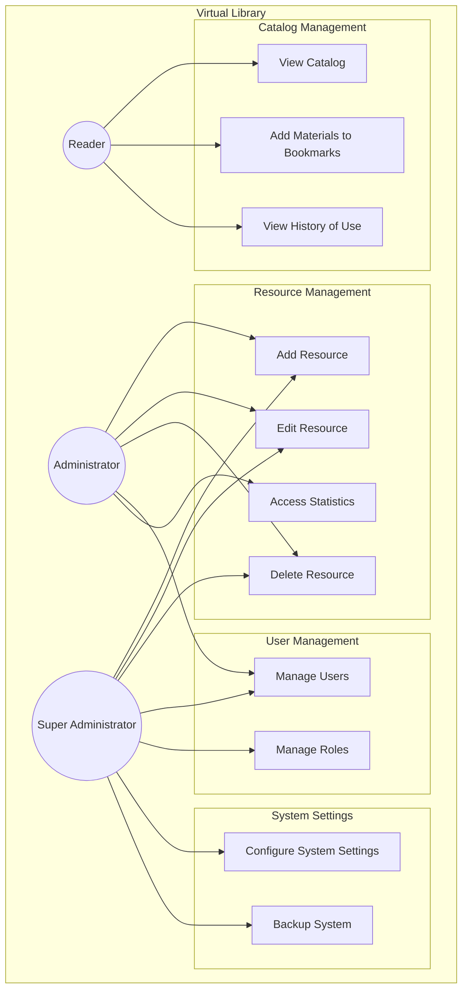

```mermaid
graph TB

  subgraph VL["Virtual Library"]

      Reader(("Reader"))

      Admin(("Administrator"))

      SuperAdmin(("Super Administrator"))

  

      subgraph SA1["Catalog Management"]

          ViewCatalog["View Catalog"]

          AddToBookmarks["Add Materials to Bookmarks"]

          ViewHistory["View History of Use"]

      end

  

      subgraph SA2["Resource Management"]

          AddResource["Add Resource"]

          EditResource["Edit Resource"]

          DeleteResource["Delete Resource"]

          AccessStatistics["Access Statistics"]

      end

  

      subgraph SA3["User Management"]

          ManageUsers["Manage Users"]

          RoleManagement["Manage Roles"]

      end

  

      subgraph SA4["System Settings"]

          ConfigureSettings["Configure System Settings"]

          BackupSystem["Backup System"]

      end

  end

  

  Reader --> ViewCatalog

  Reader --> AddToBookmarks

  Reader --> ViewHistory

  

  Admin --> AddResource

  Admin --> EditResource

  Admin --> DeleteResource

  Admin --> ManageUsers

  Admin --> AccessStatistics

  

  SuperAdmin --> AddResource

  SuperAdmin --> EditResource

  SuperAdmin --> DeleteResource

  SuperAdmin --> ManageUsers

  SuperAdmin --> RoleManagement

  SuperAdmin --> ConfigureSettings

  SuperAdmin --> BackupSystem
```
